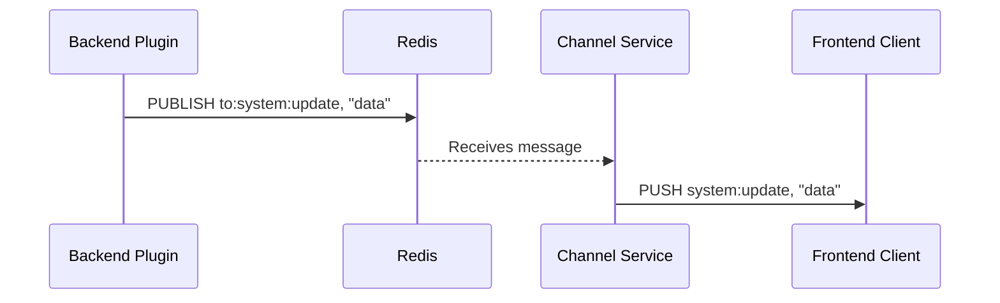
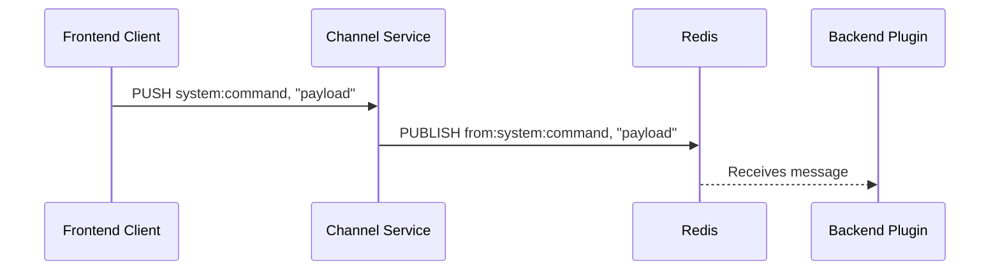

# Channel: WebSocket Communication Service

The Channel component is a Rust implementation that provides real-time bidirectional communication for Tangram using WebSockets. It implements a subset of the [Phoenix Channels protocol](https://hexdocs.pm/phoenix/channels.html), enabling seamless integration with both the frontend and backend components through Redis pub/sub messaging.

## Overview

Channel serves as the central communication hub in Tangram, connecting the frontend visualization with the backend processing plugins. It manages WebSocket connections, handles client authentication, and facilitates the bidirectional flow of data through Redis.

## Key Features

- **Channel-based Communication**: Supports multiple named channels that clients can join and leave
- **Redis Integration**: Uses Redis pub/sub for message distribution between components
- **JWT Authentication**: Secures channel access with JSON Web Tokens
- **Presence Tracking**: Tracks and broadcasts client presence information

## Communication Flow

### Backend to Frontend

1. Backend plugins publish messages to Redis topics in the format `to:<channel>:<event>`
2. Channel subscribes to these Redis topics and listens for messages
3. When a message is received, Channel forwards it to all WebSocket clients connected to the specified channel
4. Clients receive the message and can update their visualizations in real-time



### Frontend to Backend

1. WebSocket clients send messages to a specific channel with an event name
2. Channel receives these messages and publishes them to Redis topics in the format `from:<channel>:<event>`
3. Backend plugins subscribe to these Redis topics to receive client messages
4. Plugins process the messages and can respond by publishing back to `to:<channel>:<event>`



## Channel Protocol

The WebSocket protocol follows the Phoenix Channels message format, which uses JSON arrays with the following structure:

```
[join_ref, ref, topic, event, payload]
```

Where:

- `join_ref`: Reference to the channel join request (null for system messages)
- `ref`: Message reference for tracking responses
- `topic`: Channel name
- `event`: Event name
- `payload`: Message data

### Events

- `phx_join`: Join a channel (requires JWT token)
- `phx_leave`: Leave a channel
- `phx_reply`: Acknowledgment of a message
- `presence_state`: Current state of all clients in a channel
- `presence_diff`: Changes in channel presence
- Custom events: Any custom event name can be used for application-specific messages

## Usage in Tangram

### Predefined Channels

- `phoenix`: System channel for heartbeats and connection management
- `admin`: Administrative channel for monitoring and control
- `system`: General system information (includes regular datetime broadcasts)
- Custom channels: Application-specific channels can be created dynamically

### Client Connection

Clients connect to the WebSocket endpoint and can join multiple channels:

```javascript
// Connect to the WebSocket
const socket = new Phoenix.Socket("/websocket", {
  params: { userToken: token },
});
socket.connect();

// Join a channel
const channel = socket.channel("system", { token: systemToken });
channel
  .join()
  .receive("ok", (response) => console.log("Joined successfully", response))
  .receive("error", (response) => console.log("Join failed", response));

// Listen for events
channel.on("datetime", (payload) => {
  console.log("Current time:", payload.response.datetime);
});

// Send events
channel.push("custom_event", { message: "Hello from client" });
```

### Backend Integration

Backend plugins can communicate with the frontend by using Redis pub/sub:

```python
import redis
import json

r = redis.Redis()

# Send message to frontend clients
await r.publish('to:system:update', json.dumps({
    'type': 'message',
    'message': 'Update from backend'
}))

# Listen for messages from frontend
p = r.pubsub()
await p.psubscribe('from:system:*')
async for message in p.listen():
    if message['type'] == 'pmessage':
        print(f"Received: {message['data']}")
```

## Running the Channel Service

The Channel service is an integrated part of the core `tangram` application. It is automatically started as a background service when you run the `tangram serve` command. You do not need to run it separately.

Its behavior is configured in the `[channel]` section of your [`tangram.toml`](../configuration.md) file.

```toml title="tangram.toml"
[channel]
host = "127.0.0.1"
port = 2347
jwt_secret = "a-better-secret-than-this"
```

## Token Authentication

Channels require JWT tokens for authentication. Tokens can be requested from the `/token` endpoint, which is exposed on the port defined in your configuration.

```bash
curl -X POST http://localhost:2347/token \
  -H "Content-Type: application/json" \
  -d '{"channel": "system", "id": "client1"}'
```

The response includes a JWT token that can be used for channel authentication:

```json
{
  "id": "client1",
  "channel": "system",
  "token": "eyJhbGciOiJIUzI1NiIsInR5cCI6IkpXVCJ9..."
}
```

### Redis Commands for Debugging

```bash
# Subscribe to all outgoing messages from clients
redis-cli psubscribe "from:*"

# Subscribe to all incoming messages to clients
redis-cli psubscribe "to:*"

# Publish a test message to clients
redis-cli publish "to:system:test" '{"type":"message","message":"Test from Redis"}'
```