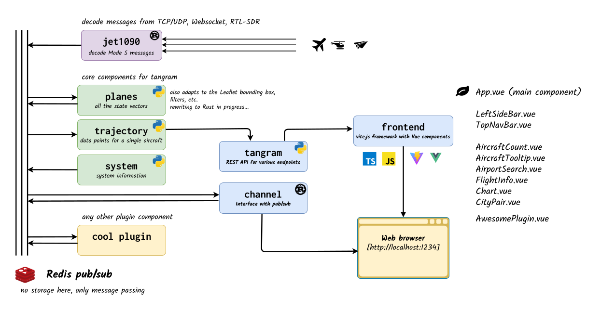

# Architecture of the tangram framework

The tangram framework consists of a suite of independent components that can be combined to create a powerful and flexible aviation data processing and visualization system.

The system consists of a web-based frontend (in Javascript :simple-javascript: based on [**Vite**](https://vite.dev/)), a backend service (in Python :simple-python:, and Rust :simple-rust: when performance is key).

Communication between the frontend and backend is done through a **REST API**, while real-time data streaming is handled via **WebSockets**. The backend service aggregates data from multiple sources, processes it, and exposes it for visualization in the frontend.

A **Redis :simple-redis: pub/sub system** is used for efficient data distribution between backend components.

## Overview of the technologies used

It is **not necessary to know all the technologies** used in the tangram framework to use it effectively, and to implement your own plugins. However, it is useful to understand the architecture and how the components interact with each other.

| Component          | Technology                                                              |
| ------------------ | ----------------------------------------------------------------------- |
| Frontend           | :simple-javascript: JavaScript (Vue.js, Vite)                           |
| Backend            | :simple-python: Python for most applications (FastAPI for the REST API) |
|                    | :simple-rust: Rust for performance critical components                  |
| Data communication | :simple-redis: Redis (pub/sub messaging system)                         |

Processes on the backend side communicate with each other using a **pub/sub mechanism** provided by Redis. The frontend communicates with the backend service through a **REST API** for simple requests and a **WebSocket connection** for real-time data streaming.

## System overview

| **Backend component** | **Description**                              |
| --------------------- | -------------------------------------------- |
| `jet1090`             | decode Mode S and ADS-B messages             |
| `planes`              | maintain a state vector table of aircraft    |
| `trajectory`          | get the history of data for a given aircraft |
| `tangram`             | REST API for data retrieval and management   |
| `channel`             | WebSocket connection for real-time updates   |

## Backend components

### jet1090

**Documentation**: <https://mode-s.org/jet1090>

`jet1090` is a Rust-based ADS-B decoder that can be used to decode ADS-B messages from a variety of sources, including software-defined radio devices and network streams such as those provided by commercial ADS-B receivers. It is designed to be fast and efficient, making it suitable for real-time applications.

### planes

**Documentation**: [planes](planes.md)

`planes` is a Python-based component that maintains a state vector table of aircraft. It is responsible for tracking the position and other parameters of aircraft in real-time. The component uses the data provided by `jet1090` to update the state vector table and provide real-time information about the aircraft.

A state vector table is a data structure that contains the latest information about all the parameters of the aircraft. This is necessary because all ADS-B messages do not provide all the parameters of the aircraft at once. In particular the position, the speed, the track angle and the identification all come in different messages. Having the most recent information along all the possible features is usually enough to display the aircraft on a map.

### trajectory

**Documentation**: [trajectory](trajectory.md)

`trajectory` is a Python-based component that provides a history of data for a given aircraft. It is responsible for storing and retrieving historical data about the aircraft's position and other parameters. The component uses the data stored by the Redis system and reformat it to be used by the frontend in a more standard JSON-like format. This is useful to be able to display the trajectory of an aircraft on a map, as well as to provide historical data for plotting, e.g. altitude, speed, vertical rate, etc.

### tangram REST API

**Documentation**: available when you run the service at <http://localhost:2345/tangram/docs>

The `tangram` component is a Python-based REST API that provides data retrieval and management capabilities. It is responsible for handling requests from the frontend and providing the necessary data for visualization and analysis. The API is designed to be modular and extensible, allowing researchers to add their own endpoints and functionality as needed.

Basic endpoints provided by the API include the data from `trajectory` and `planes`. Other endpoints are provided to facilitate the use of other data such as meteorological data through `fastmeteo` (<https://github.com/open-aviation/fastmeteo>). Since the component is based on FastAPI, it also possible to dynamically add new endpoints to the API at the plugin level. This allows researchers to create their own endpoints for specific research needs, such as custom data processing or analysis.

### channel

**Documentation**: [channel](channel.md)

The `channel` (<https://github.com/emctoo/channel>) component is a Rust-based WebSocket connection that makes the bridge between the frontend and the Redis pub/sub system. It is responsible for providing real-time updates from and to the frontend.

For instance, state vectors updates from the `planes` component are sent on the Redis pub/sub and the `channel` tool listens to the channel before sending the data to the frontend through a WebSocket. Conversely, the bounding box of the map is sent from the frontend to the `channel` component, which then sends it on the Redis pub/sub system. For example, the `planes` component listens to this channel and updates the state vector table accordingly.

## Frontend architecture

The frontend is based on Vue.js and provides a dynamic, real-time visualization interface for aviation data. It is designed to be modular, allowing users to implement their own plugins for data visualization and analysis.

The entry point is the `App.vue` file, which initializes the application and sets up the main component. At this point, the webpage is divided into:

- a main content area in the center, which displays the map with the visible aircraft;
- a navigation bar at the top, described in `components/TopNavBar.vue`;
- a sidebar on the left, described in `components/LeftSideBar.vue`, which pops up when the user clicks on an aircraft on the map.

Most other components (located in the `components/` directory) are referred to from the main `App.vue` file or from other components.

Extensions of the web application are described in the [Plugins](../plugins/index.md) section.

## Containers and process management

By default, most components run within a single container managed by [`process-compose`](https://github.com/F1bonacc1/process-compose). The tool handles process startup and shutdown; manages dependencies between processes; provides process monitoring and logging.
This architecture is defined in `container/process-compose.yaml` and can be extended to include additional services.

The description of the tangram container is defined in `container/tangram.Containerfile`.

The two components which are not running in the `tangram` container are the services that are the most natural to run on a different node:

- the Redis service, which runs in its [own _default_ container](https://hub.docker.com/_/redis);
- the `jet1090` component, which also runs in its [own container](https://ghcr.io/xoolive/jet1090) to allow for easier updates.

!!! tip

    If you want to use `jet1090` with a RTL-SDR dongle, it could be easier to configure it outside of the container as it requires access to the USB device.
