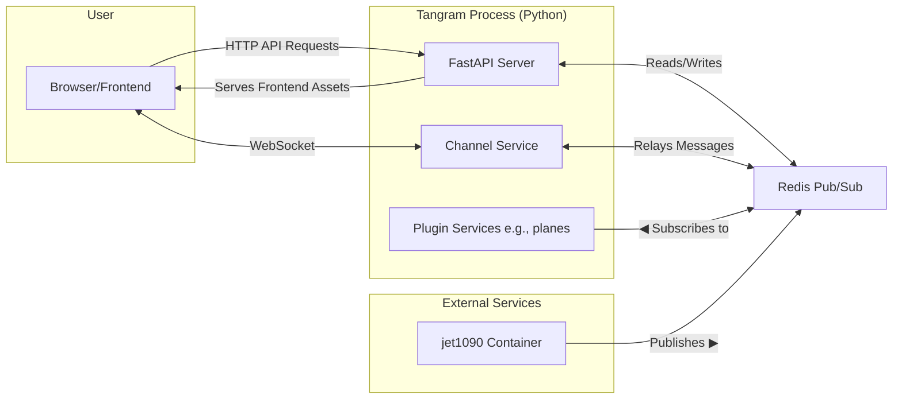
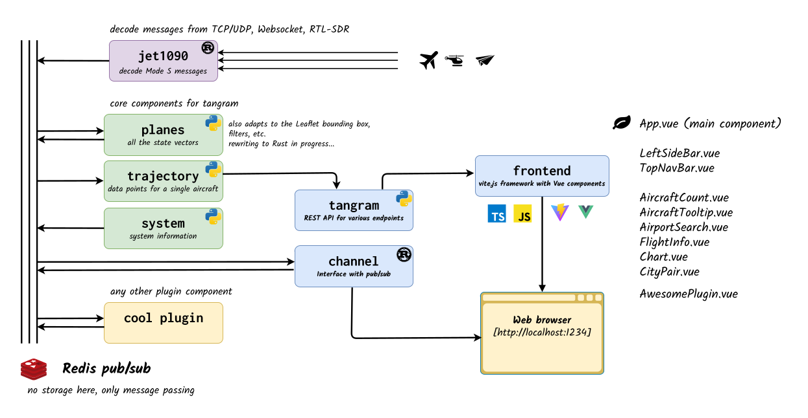

# Architecture of the tangram framework

The `tangram` framework consists of a lightweight core and a suite of independent, installable plugins that can be combined to create a powerful and flexible aviation data processing and visualization system.

The system consists of a web-based frontend (in Javascript :simple-javascript: based on [Vite](https://vite.dev/)), a backend service (in Python :simple-python:), and performance-critical components in Rust :simple-rust:.

Communication between the frontend and backend is done through a **REST API**, while real-time data streaming is handled via **WebSockets**. A **Redis :simple-redis: pub/sub system** is used for efficient data distribution between backend components.

## A Plugin-First Architecture

The core `tangram` package provides the essential scaffolding: a web server, a plugin loader, and a frontend API. All domain-specific functionality, including data decoding and processing, is implemented in separate, `pip`-installable plugins.

This design allows you to:

- install only the functionality you need.
- develop, version, and distribute your own extensions (e.g., `my-simulation-plugin`) without modifying the core `tangram` codebase.

| Component          | Technology                                                              |
| ------------------ | ----------------------------------------------------------------------- |
| Frontend           | :simple-javascript: JavaScript (Vue.js, Vite)                           |
| Backend            | :simple-python: Python for most applications (FastAPI for the REST API) |
|                    | :simple-rust: Rust for performance critical components                  |
| Data communication | :simple-redis: Redis (pub/sub messaging system)                         |

## System Overview

When you run `tangram serve`, it starts a single Python process that manages multiple asynchronous tasks for the application's core components and enabled plugins.

<!-- arch in png is outdated, maybe it was produced in drawio but i cant seem to edit it -->
<!--  -->

| **Component**             | **Provided By**                                   | **Description**                                                |
| ------------------------- | ------------------------------------------------- | -------------------------------------------------------------- |
| `tangram` (Core)          | `tangram_core` package                            | REST API server, CLI, and frontend shell.                      |
| [`channel`](./channel.md) | (Bundled with `tangram`)                          | WebSocket bridge between the frontend and Redis pub/sub.       |
| `jet1090` integration     | [`tangram_jet1090` plugin](../plugins/jet1090.md) | Decodes Mode S/ADS-B messages and provides data streams.       |
| State Vectors & History   | [`tangram_jet1090` plugin](../plugins/jet1090.md) | Maintains real-time state and stores historical aircraft data. |
| System Info               | [`tangram_system` plugin](../plugins/system.md)   | Provides backend server metrics like CPU and memory usage.     |
| Weather Layers            | [`tangram_weather` plugin](../plugins/weather.md) | Provides API endpoints for meteorological data.                |

## Backend Plugin System

The backend discovers plugins using Python's standard **[entry point mechanism](https://packaging.python.org/en/latest/specifications/entry-points/)**. When you `pip install tangram_jet1090`, it registers itself under the `tangram_core.plugins` group in its `pyproject.toml`. The core `tangram` application queries these groups at startup to find and load all available plugins, allowing them to add their own [API routes](../plugins/backend.md#adding-api-endpoints) and [background tasks](../plugins/backend.md#creating-background-services).

For a detailed guide on creating your own backend extensions, see the [Backend Plugin Guide](../plugins/backend.md).

## Frontend Plugin System

The frontend loads plugins dynamically. The backend serves a `/manifest.json` file listing all enabled frontend plugins. The core `tangram` web application fetches this manifest and dynamically imports the JavaScript entry point for each plugin. The plugin's entry point then calls the [`tangramApi.registerWidget()`](../plugins/frontend.md) function to add its Vue components to the main application.

For more details, see the [Frontend Plugin Guide](../plugins/frontend.md).
