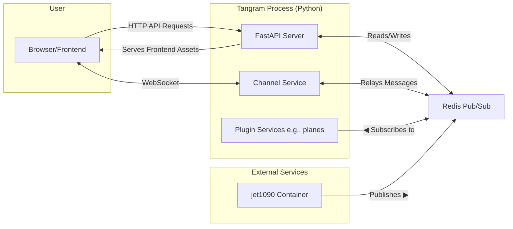
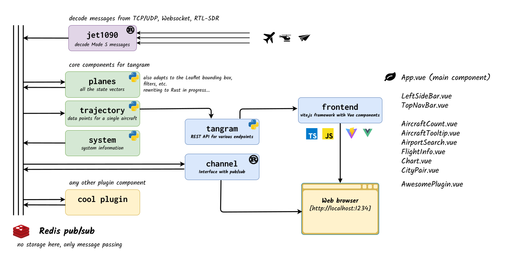

# Architecture of the tangram framework

The `tangram` framework consists of a lightweight core and a suite of independent, installable plugins that can be combined to create a powerful and flexible aviation data processing and visualization system.

The system consists of a web frontend written in JavaScript :simple-javascript: with Vue and Vite, a Python :simple-python: backend, and performance-critical Rust :simple-rust: components.

Communication between the frontend and backend is done through a **REST API**, while real-time data streaming is handled via **WebSockets**. A **Redis :simple-redis: pub/sub system** is used for efficient data distribution between backend components.

## A Plugin-First Architecture

The core `tangram` package provides the essential scaffolding: a web server, a plugin loader, and a frontend API. All domain-specific functionality, including data decoding and processing, is implemented in separate, `pip`-installable plugins.

This design allows you to:

- install only the functionality you need.
- develop, version, and distribute your own extensions (e.g., `my-simulation-plugin`) without modifying the core `tangram` codebase.

| Component          | Technology                                                              |
| ------------------ | ----------------------------------------------------------------------- |
| Frontend           | :simple-javascript: JavaScript (Vue.js, Vite)                           |
| Backend            | :simple-python: Python for most applications (FastAPI for the REST API) |
|                    | :simple-rust: Rust for performance-critical components                  |
| Data communication | :simple-redis: Redis (pub/sub messaging system)                         |

## System Overview

When you run `tangram serve`, it starts a single Python process that manages multiple asynchronous tasks for the application's core components and enabled plugins.

```mermaid
graph LR
    subgraph User
        B[Browser/Frontend]
    end

    subgraph "Tangram Process (Python)"
        direction TB
        FAS[FastAPI Server]
        CS[Channel Service]
        PS[Plugin Services e.g., planes]
    end

    subgraph "External Services"
        J[jet1090 Container]
    end

    R[Redis Pub/Sub]

    B -- HTTP API Requests --> FAS
    B <-- WebSocket --> CS
    FAS -- Serves Frontend Assets --> B
    FAS <-- Reads/Writes --> R
    CS <-- Relays Messages --> R
    PS -- ◀ Subscribes to --> R
    J -- Publishes ▶ --> R
```

<!-- arch in png is outdated, maybe it was produced in drawio but i cant seem to edit it -->
<!--  -->

| **Component**             | **Provided By**                                     | **Description**                                               |
| ------------------------- | --------------------------------------------------- | ------------------------------------------------------------- |
| `tangram` (Core)          | `tangram_core` package                              | REST API server, CLI, and frontend shell.                     |
| [`channel`](./channel.md) | (Bundled with `tangram`)                            | WebSocket bridge between the frontend and Redis pub/sub.      |
| `jet1090` integration     | [`tangram_jet1090` plugin](../plugins/jet1090.md)   | Decodes Mode S/ADS-B messages and provides data streams.      |
| `datalink` integration    | [`tangram_datalink` plugin](../plugins/datalink.md) | Bridges normalized ACARS/VDL2/HFDL/Airframes datalink events. |
| Aircraft state vectors    | [`tangram_jet1090` plugin](../plugins/jet1090.md)   | Maintains live aircraft state and exposes trajectory data.    |
| Historical storage        | [`tangram_history` plugin](../plugins/history.md)   | Persists time-series data produced by other plugins.          |
| System Info               | [`tangram_system` plugin](../plugins/system.md)     | Provides backend server metrics like CPU and memory usage.    |
| Weather Layers            | [`tangram_weather` plugin](../plugins/weather.md)   | Provides API endpoints for meteorological data.               |

## Backend Plugin System

The backend discovers plugins using Python's standard **[entry point mechanism](https://packaging.python.org/en/latest/specifications/entry-points/)**. When you `pip install tangram_jet1090`, it registers itself under the `tangram_core.plugins` group in its `pyproject.toml`. The core `tangram` application queries these groups at startup to find and load all available plugins, allowing them to add their own [API routes](../plugins/backend.md#adding-api-endpoints) and [background tasks](../plugins/backend.md#creating-background-services).

For a detailed guide on creating your own backend extensions, see the [Backend Plugin Guide](../plugins/backend.md).

## Frontend Plugin System

The backend serves `/manifest.json` with the enabled frontend plugins and their asset manifests. The browser imports each plugin entry module and awaits its `install(ctx)` function. Plugins register widgets, layers, search providers, and other resources through the scoped context, for example `ctx.api.ui.registerWidget(...)`.

For implementation details, see the [Frontend Plugin Guide](../plugins/frontend.md) and [Frontend API](../plugins/frontend-api.md).
