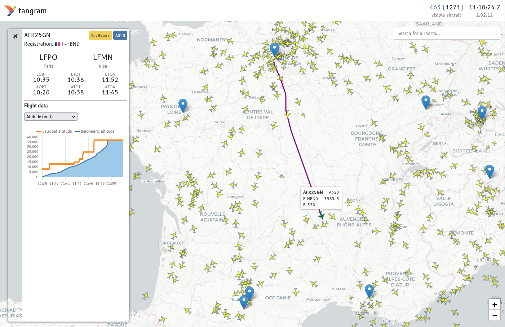

# tangram: an open platform for modular, real-time air traffic management research

**tangram** is an open research framework for ADS-B and Mode S flight surveillance data designed for various **real-time aviation research topics** such as GNSS jamming detection, aviation weather monitoring, emission analysis, and airport performance monitoring.

## Introduction

The system consists of a **JavaScript**-based **web application** and a **backend based on Python** or Rust when performance is crucial. The web application is designed to be modular, allowing users to **implement their own plugins** for data processing and analysis. The backend is responsible for data collection, storage, and processing, while the frontend provides a user-friendly interface for visualizing and interacting with the data.

The whole framework is designed to be extensible, allowing researchers to develop and integrate their own plugins for specific research needs. This modularity enables the community to contribute to the platform, encouraging collaboration and knowledge sharing.

## Contents

- [Quickstart](quickstart.md): A step-by-step guide to get started with tangram
- [Configuration](configuration.md): Information on how to configure the system for your needs
- [Architecture](architecture.md): An overview of the system architecture and components
- [Plugins](plugins/index.md): Extend the system with custom functionalities
- [Contribute to tangram](contributing.md): Guidelines for contributing to the project

## Funding

This project is currently funded by the Dutch Research Council (NWO)'s Open Science Fund, **OSF23.1.051**: <https://www.nwo.nl/en/projects/osf231051>.

## History

In 2020, [@junzis](https://github.com/junzis) and [@xoolive](https://github.com/xoolive) published a paper [Detecting and Measuring Turbulence from Mode S Surveillance Downlink Data](https://research.tudelft.nl/en/publications/detecting-and-measuring-turbulence-from-mode-s-surveillance-downl-2) on how real-time Mode S data can be used to detect turbulence.

Based on this method, [@MichelKhalaf](https://github.com/MichelKhalaf) started developing this tool as part of his training with [@xoolive](https://github.com/xoolive) in 2021, which was completed in Summer 2022. After that, the project was then lightly maintained by [@xoolive](https://github.com/xoolive) and [@junzis](https://github.com/junzis), while we have been applying for funding to continue this tool.

And in 2023, we received funding from NWO to continue the development of this tool. With this funding, [@emctoo](https://github.com/emctoo) from [Shinetech](https://www.shinetechsoftware.com) was hired to work alongside us on this open-source project.
