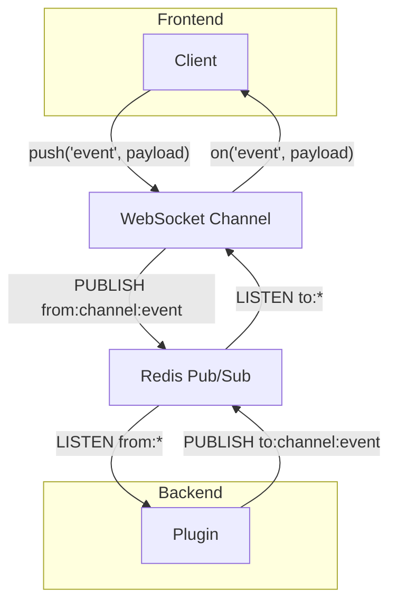

Backend plugins are the standard way to add new server-side capabilities to `tangram`. They are self-contained Python packages that `tangram` discovers and loads at runtime, allowing for clean separation from the core framework.

This guide covers the key concepts for building a backend plugin.

## Plugin Anatomy

A `tangram` plugin is a standard Python package that exposes its functionality through two key mechanisms: an entry point and a [`Plugin`][tangram_core.Plugin] object.

Assuming you have the following project structure:

```text
my-tangram-plugin/
├── pyproject.toml
└── src/
    └── my_plugin/
        └── __init__.py
```

### 1. The `pyproject.toml` Entry Point

Your `pyproject.toml` must declare an entry point under the `tangram_core.plugins` group. This makes your package discoverable by the core application.

```toml title="pyproject.toml" hl_lines="6 7"
[project]
name = "my-tangram-plugin"
version = "0.1.0"
dependencies = ["tangram_core>=0.2.0"]

[project.entry-points."tangram_core.plugins"]
my_plugin = "my_plugin:plugin"
```

### 2. The `Plugin` Object

The entry point must point to an instance of the `tangram_core.Plugin` class. This object is the central hub for registering your plugin's components.

```py title="src/my_plugin/__init__.py"
import tangram_core

plugin = tangram_core.Plugin(
    # ... component registrations go here ...
)
```

## Adding API Endpoints

To add REST API endpoints, define a standard FastAPI [`APIRouter`][fastapi.APIRouter] and pass a list of routers to the [`Plugin`][tangram_core.Plugin] constructor. `tangram` will automatically mount them into the main application.

```py title="src/my_plugin/__init__.py" hl_lines="11"
import tangram_core
from fastapi import APIRouter

router = APIRouter(prefix="/my-plugin")

@router.get("/")
async def my_endpoint():
    return {"message": "Hello from my custom plugin!"}

plugin = tangram_core.Plugin(
    routers=[router]
)
```

## Creating Background Services

To run persistent background tasks, use the [`@plugin.register_service` decorator][tangram_core.Plugin.register_service]. The decorated function will be started as a background task when `tangram serve` runs.

The service function receives a [`tangram_core.BackendState`][] object, which provides access to core components like the Redis client.

```py title="src/my_plugin/__init__.py" hl_lines="6"
import asyncio
import tangram_core

plugin = tangram_core.Plugin()

@plugin.register_service()
async def run_periodic_task(backend_state: tangram_core.BackendState):
    """A background service that publishes a message every 10 seconds."""
    redis_client = backend_state.redis_client
    while True:
        await redis_client.publish("my-plugin:status", "alive")
        await asyncio.sleep(10)
```

## Inter-Component Communication with Redis

Redis pub/sub is the backbone for real-time communication between all `tangram` components, including backend services, the frontend, and performance-critical Rust modules.

### Communicating with the Frontend via WebSockets

The `channel` service acts as a transparent bridge between Redis and frontend WebSockets. A simple convention is used for routing messages:



- **Backend to Frontend**: To send a message to the frontend, publish it to a Redis channel prefixed with `to:<channel_name>:<event_name>`. The `channel` service relays this to the browser.
- **Frontend to Backend**: When the frontend sends a message, the `channel` service relays it to a Redis channel prefixed with `from:<channel_name>:<event_name>`.


### Publishing Messages

You can publish messages from any backend service using the Redis client available in [`tangram_core.BackendState`][].

=== "Python"

    ```py
    # from within a service function
    redis_client = backend_state.redis_client
    await redis_client.publish("to:system:update", "Hello from plugin")
    ```

=== "Rust"

    ```rs
    let redis_client = redis::Client::open("redis://localhost:6379").unwrap()?;
    let mut con = redis_client.get_multiplexed_async_connection().await?;
    con.publish("to:system:update", "Hello from plugin").await?;
    ```

### Subscribing to Messages

To handle incoming messages, `tangram` provides a [`Subscriber`][tangram_core.redis.Subscriber] base class. This is the recommended pattern for creating robust, long-running listeners within a service.

```py title="src/my_plugin/__init__.py"
import asyncio
from dataclasses import dataclass
import tangram_core
from tangram_core.redis import Subscriber

plugin = tangram_core.Plugin()

@dataclass
class CommandSubscriberState:
    command_count: int = 0

class CommandSubscriber(Subscriber[CommandSubscriberState]):
    """A subscriber that listens for commands on a Redis channel."""
    async def message_handler(
        self, event: str, payload: str, pattern: str, state: CommandSubscriberState
    ) -> None:
        state.command_count += 1
        print(f"Command #{state.command_count} received on `{event}`: {payload}")

@plugin.register_service()
async def run_command_listener(backend_state: tangram_core.BackendState) -> None:
    """This service listens for commands from the frontend."""
    subscriber = CommandSubscriber(
        name="CommandListener",
        redis_url=backend_state.config.core.redis_url,
        channels=["from:system:my-plugin-command"],
        initial_state=CommandSubscriberState(),
    )
    await subscriber.subscribe()
    try:
        await asyncio.Future()  # run forever
    finally:
        await subscriber.cleanup()
```

## Using Your Plugin

Install your package in the same environment as `tangram` and enable it in your `tangram.toml`:

```toml
[core]
plugins = ["my_tangram_plugin"]
```

Run `tangram serve`. The core application will load your plugin, making its API endpoints available and starting its background services. The full API documentation, including your new endpoint, is available at <http://localhost:2346/docs>.
