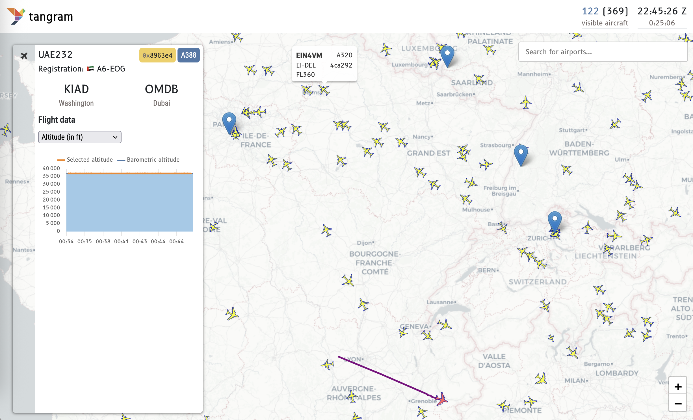

# Origin and destination city pair

## Statement of need

The city pair plugin displays the origin and destination information for the selected aircraft, showing both the airport codes (ICAO) and the city names. This makes it easy to quickly understand the flight route without leaving the main map interface.

## Implementation

The implementation of the city pair plugin is a Vue.js component that displays the origin and destination of a flight when an aircraft is selected on the map. The implementation is located in the `src/plugins/CityPair.vue` file.

!!! tip

    When a Vue component is a plugin, its implementation can be overridden by a custom implementation located in a different directory. This is useful if you want to have several possible implementations for a functionality, or if you want to use a different implementation for a specific use case.
    This is particularly useful if you have a custom implementation of the city pair plugin using different sources of data (specific airport or airline development API, EUROCONTROL B2B, etc.) that are not necessarily publicly available, or not without a private token.

    If the environment variable `TANGRAM_WEB_CITYPAIR_PLUGIN` is defined, the plugin will be loaded from the specified path. Otherwise, it will be loaded from the default fallback location. You can specify the path to your custom implementation in the `.env` file.

In this example, the flight route information is obtained from the OpenSky Network's route service, which provides origin-destination pairs based on the flight's callsign.
The city names are retrieved using the `airport_information` function from the [`rs1090-wasm` library](https://www.npmjs.com/package/rs1090-wasm).

### 1. Declare the plugin in the `vite.config.js` file

In order to use the `CityPair` component as a plugin, you need to declare it in the `vite.config.js` file:

```javascript
plugins: [
  // ..., other settings
  dynamicComponentsPlugin({
    envPath: "../.env",
    fallbackDir: "/src/plugins/",
    availablePlugins: [
      "airportSearch",
      "systemInfo",
      "sensorsInfo",
      // "windField",
      "cityPair",  // <-- new line
    ],
  }),
],
```

### 2. Configure proxy for the route API

The city pair plugin needs to fetch route information from an external API.

When we fetch data from an external API, we often encounter CORS (Cross-Origin Resource Sharing) issues, which is a security feature implemented by web browsers to prevent malicious websites from making requests to other domains. This can block our requests to the OpenSky Network's route service.
To avoid these issues, we can set up a proxy in the `vite.config.js` file to redirect requests to the external API: we create the `/route` endpoint in the proxy configuration, which will redirect requests to the OpenSky Network's route service.

```javascript
server: {
  proxy: {
    // ..., other settings
    "/route": {
      target: "https://flightroutes.opensky-network.org",
      agent: proxy_agent,
      changeOrigin: true,
      secure: true,
      rewrite: () => "/api/routeset",
    },
  },
},
```

!!! tip

    If you have proxy settings configured in your environment, the `proxy_agent` will automatically use them. This allows you to work with the OpenSky Network's route service without needing to modify the code.

### 3. Implement the Vue component

The `CityPair.vue` component has three main sections: template, script and style.

The template section displays the origin and destination airports with their respective city names. The template section controls the structure of the DOM elements and how they are displayed in the browser. We use here Vue's conditional rendering to display the city pair information only when both origin and destination are available. We also display loading and error messages based on the component's state.

```vue
<template>
  <div id="city_pair" v-if="origin && destination">
    <div class="airport">
      <span class="icao">{{ origin }}</span>
      <span class="city">{{ originName }}</span>
    </div>
    <div class="airport">
      <span class="icao">{{ destination }}</span>
      <span class="city">{{ destinationName }}</span>
    </div>
  </div>
  <div v-else-if="loading" class="loading">Loading route information...</div>
  <div v-else-if="error" class="error">
    {{ error }}
  </div>
</template>
```

In the script section, the model needs to store the origin and destination airport codes, their city names, and the loading/error states. It uses the `useMapStore` to access the selected aircraft from the global state.

We need to:

- watch for changes in the selected aircraft
- fetch route data when an aircraft is selected
- reset data when the selected aircraft changes

```vue
<script>
import { useMapStore } from "@store";
import { airport_information } from "rs1090-wasm";

export default {
  data() {
    return {
      store: useMapStore(),
      loading: false,
      error: null,
      origin: null,
      destination: null,
      originName: null,
      destinationName: null,
    };
  },
  computed: {
    selected() {
      return this.store.selectedPlane;
    },
  },
  watch: {
    selected: {
      // Watch for changes in selected aircraft
      handler(newValue) {
        this.resetData();
        if (newValue && newValue.callsign) {
          this.fetchRouteData(newValue.callsign.trim());
        }
      },
      deep: true,
      immediate: true,
    },
  },
  methods: {
    // Fetch route data from API
    fetchRouteData(callsign) {
      // Make API request to get route data
      // Process response and set city names
    },
  },
};
</script>
```

### 4. Refer to the component in the main application

Once declared as a plugin, you can use the component in any Vue file by adding:

```vue
<plugin-citypair />
```

This will render the city pair information when an aircraft is selected on the map.

### 5. Reload your application

After implementing the plugin and configuring the proxy, reload your application to see the city pair information when selecting aircraft on the map. You should see both the ICAO codes and city names for the origin and destination airports.



!!! warning

    The OpenSky Network's route service is not guaranteed to be available at all times and for all aircraft, so the plugin may not always display data. If the service is down or the request fails, the plugin will show an error message instead of the city pair information.
