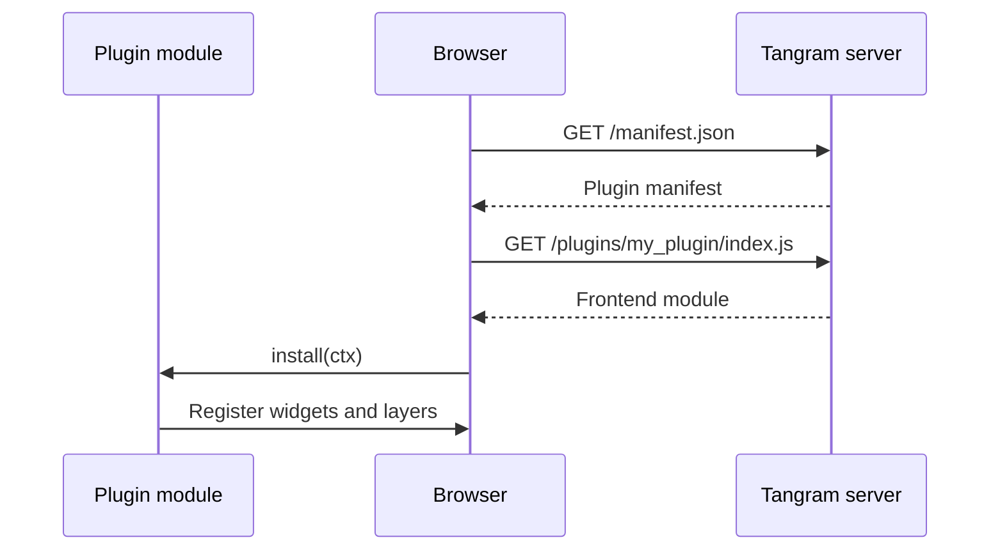

# Frontend

A frontend plugin adds Vue components and Deck.gl layers to the `tangram` web interface. It is normally bundled with a [backend plugin](backend.md), so users install one Python package containing both the plugin entry point and the pre-built frontend assets.

## Project structure

Start with the Python package and entry point from the [backend plugin guide](backend.md#plugin-anatomy), then add the frontend files:

```bash
my-tangram-plugin/
├── package.json   # (1)!
├── pyproject.toml  # (2)!
├── vite.config.js
└── src/my_plugin/
    ├── __init__.py
    ├── index.js
    └── MyWidget.vue
```

1. `package.json` owns the frontend dependencies and build.
2. `pyproject.toml` owns the installable plugin and bundles the generated
   frontend assets in its wheel.

## Package configuration

The `main` field points to the frontend entry point.

```json title="package.json"
{
  "name": "@my-org/my-tangram-plugin",
  "version": "0.1.0",
  "private": true,
  "type": "module",
  "main": "src/my_plugin/index.js",
  "scripts": {
    "build": "vite build"
  },
  "dependencies": {
    "@open-aviation/tangram-core": "^0.5.0"
  },
  "devDependencies": {
    "vite": "^8.1.0",
    "vue": "^3.5.38"
  }
}
```

Keep the Python and npm core dependencies on the same supported minor release.

## Plugin entry point

The module specified by `main` exports an `install` function. The plugin-scoped context identifies the plugin and provides the shared Tangram APIs. Register passive resources with `pluginId: ctx.id`; register active resources with `ctx.onDispose`.

```javascript title="src/my_plugin/index.js"
import MyWidget from "./MyWidget.vue";

export function install(ctx) {
  ctx.api.ui.registerWidget("my-widget", "SideBar", MyWidget, {
    pluginId: ctx.id,
    title: "My Widget"
  });
}
```

## Vite configuration

The shared Vite plugin builds the frontend as an ES module and writes the `plugin.json` manifest used by `tangram` at runtime.

```javascript title="vite.config.js"
import { defineConfig } from "vite";
import { tangramPlugin } from "@open-aviation/tangram-core/vite-plugin";

export default defineConfig({
  plugins: [tangramPlugin()]
});
```

??? note "TypeScript setup (highly recommended!)"

    Rename `index.js` to `index.ts` and `vite.config.js` to `vite.config.ts`, then merge these fields into `package.json`:

    ```json title="package.json"
    {
      "main": "src/my_plugin/index.ts",
      "scripts": {
        "build": "vite build",
        "typecheck": "vue-tsc --noEmit -p tsconfig.json",
        "typecheck:vite": "tsc --noEmit -p tsconfig.vite.json",
        "check": "pnpm typecheck && pnpm typecheck:vite"
      },
      "devDependencies": {
        "@types/node": "^26.0.0",
        "typescript": "^6.0.3",
        "vue-tsc": "3.3.4"
      }
    }
    ```

    Extend the configurations published by `@open-aviation/tangram-core`:

    ```json title="tsconfig.json"
    {
      "extends": "@open-aviation/tangram-core/tsconfig.plugin.json",
      "include": ["src/**/*.ts", "src/**/*.vue"]
    }
    ```

    The Vite configuration runs in Node and is checked separately:

    ```json title="tsconfig.vite.json"
    {
      "extends": "@open-aviation/tangram-core/tsconfig.node.json",
      "include": ["vite.config.ts"]
    }
    ```

    Type the plugin entry point with `PluginContext`:

    ```typescript title="src/my_plugin/index.ts"
    import type { PluginContext } from "@open-aviation/tangram-core/api";
    import MyWidget from "./MyWidget.vue";

    export function install(ctx: PluginContext) {
      ctx.api.ui.registerWidget("my-widget", "SideBar", MyWidget, {
        pluginId: ctx.id,
        title: "My Widget"
      });
    }
    ```

    Note that as of `@open-aviation/tangram-core` v0.5.0 does not publish a declaration for the `vite-plugin` subpath, and is a known bug that is being worked on. Supress the error:

    ```typescript title="vite.config.ts"
    import { defineConfig } from "vite";
    // @ts-expect-error tangram-core 0.5.0 does not publish this subpath's types
    import { tangramPlugin } from "@open-aviation/tangram-core/vite-plugin";

    export default defineConfig({
      plugins: [tangramPlugin()]
    });
    ```

## Building and packaging

When you run `pnpm build`, it produces all assets (`index.js`, stylesheets and `plugin.json`) under the `dist-frontend` directory. Your build backend should be configured to include it when you publish the Python wheel, for example, if you are using hatchling:

```toml title="pyproject.toml"
[tool.hatch.build.targets.sdist]
ignore-vcs = true
include = ["dist-frontend/*", "src/*", "package.json"]

[tool.hatch.build.targets.wheel.force-include]
"dist-frontend" = "my_plugin/dist-frontend"
"package.json" = "my_plugin/package.json"
```

```py title="src/my_plugin/__init__.py"
import tangram_core

plugin = tangram_core.Plugin(frontend_path="dist-frontend")
```

If you are using the maturin build backend, call `tangramPlugin({ copyToPythonPackage: true })` so the generated assets are copied under the Python source tree before the wheel is built.

Build the frontend before installing or building the Python package because
`dist-frontend` is a package input:

```sh
pnpm install --frozen-lockfile
# if you use typescript:
pnpm check
pnpm build
uv sync
uv run tangram check-plugin .
uv build
```

Install the wheel in a clean environment and verify that `tangram list-plugins --all` discovers its backend and frontend components.

## Runtime loading

After the package is installed and enabled in `tangram.toml`, the server reads `plugin.json` and exposes the frontend assets under `/plugins/<plugin-name>/`. The browser imports the module and calls `install` with its plugin-scoped context.



!!! tip

    If you modify the frontend, run `pnpm build` so the `tangram serve` command can pick it up immediately.

    No restart of the tangram server is needed unless you modify the backend.
