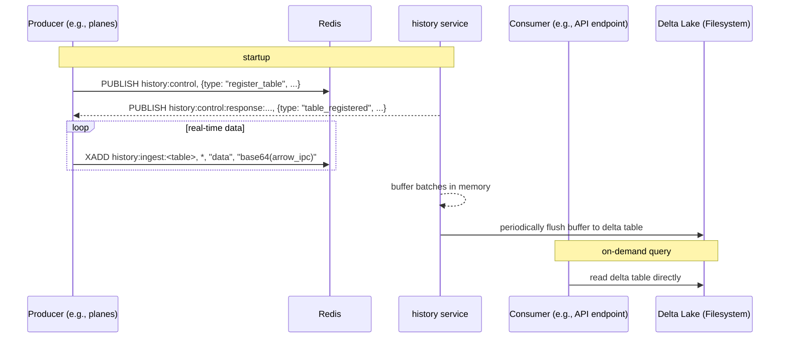

# History Plugin

The `tangram_history` plugin provides a centralized, durable persistence layer for tangram. It ingests high-frequency, append-only time-series data from producer plugins (like [`tangram_jet1090`](./jet1090.md) or [`tangram_ship162`](./ship162.md)) and stores it efficiently in [Delta Lake tables](https://delta.io/blog/delta-lake-vs-parquet-comparison/).

- buffers incoming records in memory and flushes them periodically as larger, optimized parquet files.
- uses Delta Lake for transactional writes, schema enforcement, and compatibility with query engines (datafusion, polars, duckdb...).
- makes no assumptions about data content: producers register their own schemas and data retention policies.



## Protocol

### Control channel (`history:control`)

Used for managing tables. Producers must register a table and its schema before sending data.

- message: `register_table`
- payload fields:
    - `sender_id`: a unique id for the producer instance.
    - `table_name`: a unique name for the table (e.g., `"aircraft_states"`).
    - `schema`: base64-encoded arrow ipc **schema** bytes.
    - `partition_columns`: list of column names to partition by.
    - `optimize_interval_secs`: how often to run `optimize`.
    - `vacuum_interval_secs`: how often to run `vacuum`.
    - `vacuum_retention_period_secs`: retention for `vacuum`.

### Ingest stream (`history:ingest:<table_name>`)

A fire-and-forget redis stream for producers to send data.

- command: `XADD`
- payload: a key-value pair `data` and a base64-encoded arrow ipc **recordbatch** in stream format.

## Configuration

The history service itself has minimal configuration. All per-table settings are provided by the producer plugins that use it.

```toml title="tangram.toml"
[core]
plugins = ["tangram_history", "tangram_jet1090"]

# global settings for the history service
[plugins.tangram_history]
# base path on the local filesystem for storing delta tables.
base_path = "/tmp/tangram_history"
# redis channel for control messages.
control_channel = "history:control"

# producer-specific settings
[plugins.tangram_jet1090]
history_table_name = "jet1090"
history_flush_interval_secs = 5
# ... other history settings for this table
```

!!! warning

    Note that the [Delta Lake protocol](https://github.com/delta-io/delta/blob/master/PROTOCOL.md#primitive-types) only supports a subset of [Parquet primitive types](https://github.com/apache/parquet-format/blob/master/LogicalTypes.md#numeric-types).

    Notably, **unsigned integers are not supported** and will be implicitly downcasted!
