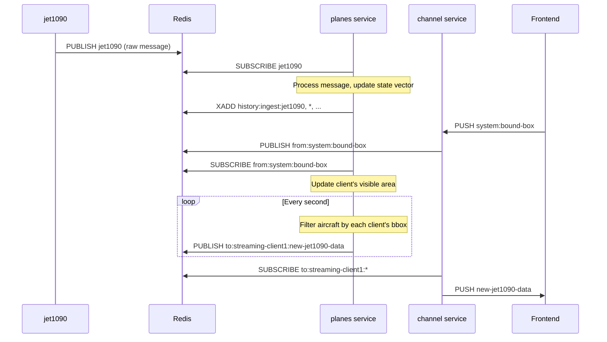

# Jet1090 Plugin

The `tangram_jet1090` plugin is the primary tool for integrating Mode S and ADS-B data into the `tangram` framework. It processes raw aviation surveillance data from a `jet1090` instance and makes it available for both real-time visualization and historical analysis.

## Overview

This plugin consists of:

- **A background service ([planes][tangram_jet1090.run_planes])** to maintain a real-time state of all visible aircraft and persist their data for historical queries.
- **A REST API endpoint ([`/data/{icao24}`][tangram_jet1090.get_trajectory_data])** to fetch the full, time-ordered trajectory for a specific aircraft.
- **A frontend widget** to display a placeholder in the UI.

## `planes` Service

The `planes` service is the core of the real-time functionality. It is a Rust-based component, wrapped with PyO3 for integration into the Python ecosystem.



- **Continuous Tracking**: It subscribes to the `jet1090` Redis channel to receive decoded aircraft messages.
- **State Vector Maintenance**: It maintains a comprehensive in-memory view of the current air traffic situation by collecting and processing state vectors for all active aircraft.
- **History Persistence**: It acts as a producer for the [`tangram_history` plugin](./history.md). It batches raw messages into arrow Recordbatches and sends them to a redis stream. The history service consumes this stream and persists the data into a delta lake table. **(Optional: requires `tangram_history` to be installed)**.
- **Client-Specific Filtering**: The service listens for bounding box updates from each connected frontend client. It filters the aircraft data for each client, sending only the aircraft visible within their map view.
- **Data Publishing**: Once per second, it publishes the filtered state vectors to a dedicated Redis channel for each client (e.g., `to:streaming-<client_id>:new-jet1090-data`), which are then relayed to the browser via the WebSocket `channel` service.

## Redis Events

| Direction | Channel                              | Event/Command | Payload                                                            |
| :-------- | :----------------------------------- | :------------ | :----------------------------------------------------------------- |
| Input     | `jet1090`                            | `PUBLISH`     | Raw JSON message from `jet1090`.                                   |
| Output    | `to:streaming-{id}:new-jet1090-data` | `PUBLISH`     | `{ "count": 123, "aircraft": [...] }` containing visible aircraft. |
| Output    | `history:ingest:jet1090`             | `XADD`        | Apache Arrow record batch (binary).                                |

## Trajectory API

The plugin provides an API for querying the historical data persisted by the `planes` service.

**Endpoint**: `GET /jet1090/data/{icao24}`

Retrieves all historical data points for the given aircraft `icao24` by querying the delta lake table managed by the history service.

This endpoint is used by the frontend to draw historical flight paths and populate data charts when an aircraft is selected.

## Configuration

To use this plugin, you must have a running `jet1090` instance publishing data to Redis. You can also configure the plugin in your [tangram.toml](../configuration.md)::

```toml
[core]
plugins = ["tangram_jet1090", "tangram_history"]

[plugins.tangram_jet1090]
# the redis channel that jet1090 is publishing to.
jet1090_channel = "jet1090"
# how long (in seconds) to keep an aircraft in the state vector table
# after its last message.
state_vector_expire = 20

# history persistence settings (requires `tangram_history` plugin)
history_table_name = "jet1090"
history_flush_interval_secs = 5
history_buffer_size = 100000
```

See [`tangram_jet1090.PlanesConfig`][] for all available options.
