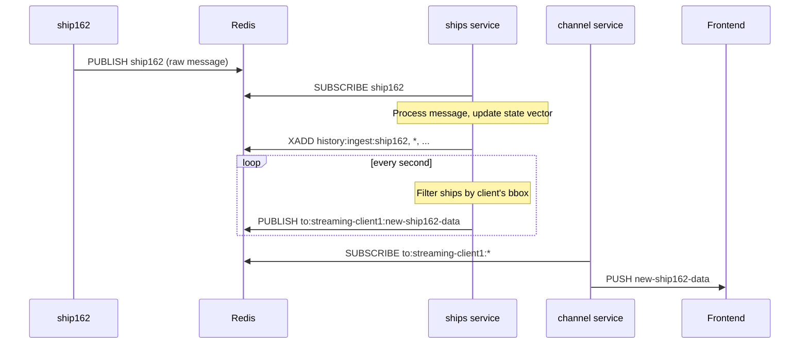

# Ship162 Plugin

The `tangram_ship162` plugin integrates AIS data from a `ship162` instance, enabling real-time visualization and historical analysis of maritime traffic.

## Overview

- a background service to maintain a real-time state of all visible ships and persist their data.
- a rest api endpoint (`/data/ship/{mmsi}`) to fetch the full, time-ordered trajectory for a specific ship.
- frontend components to render ships on the map and display detailed information.



## Redis Events

| Direction | Channel                              | Event/Command | Payload                                                     |
| :-------- | :----------------------------------- | :------------ | :---------------------------------------------------------- |
| Input     | `ship162`                            | `PUBLISH`     | Raw JSON message from `ship162`.                            |
| Output    | `to:streaming-{id}:new-ship162-data` | `PUBLISH`     | `{ "count": 123, "ship": [...] }` containing visible ships. |
| Output    | `history:ingest:ship162`             | `XADD`        | Apache Arrow record batch (binary).                         |

## Configuration

To use this plugin, you must have a running `ship162` instance publishing data to redis.

```toml title="tangram.toml"
[core]
plugins = ["tangram_ship162", "tangram_history"]

[plugins.tangram_ship162]
# redis channel that ship162 is publishing to.
ship162_channel = "ship162"

# how long (in seconds) to keep a ship in the state vector table
# after its last message.
state_vector_expire = 600

# history persistence settings
history_table_name = "ship162"
history_flush_interval_secs = 5
history_buffer_size = 100000
```
