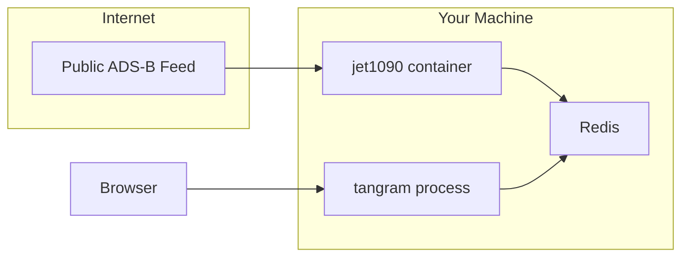

- **For Users:** To install and run `tangram` with official plugins, [start here &raquo;](#user-quickstart)
- **For Developers:** To contribute to the `tangram` core project, [set up the monorepo &raquo;](#developer-quickstart)
- **For Plugin Authors:** To build your own extensions for `tangram`, read the [plugin development guide &raquo;](./plugins/backend.md)

---

## User Quickstart

### Prerequisites

Ensure you have the following installed:

- redis 8 or above (via [podman](https://podman.io/docs/installation)/[docker](https://docs.docker.com/engine/install/) or system-installed version)
- Python 3.10 or above

### 1. Install the `tangram` core

=== "uv"

    ```sh
    uv tool install tangram_core
    ```

=== "pip"

    ```sh
    python3 -m venv .venv
    source .venv/bin/activate
    pip install tangram_core
    ```

For end users, the only supported installation method is from a package index (like PyPI) that hosts pre-built binary wheels. For developers wanting to use the latest git version, refer to the developer guide [below](#developer-quickstart).

### 2. Configuration

Create a `tangram.toml` file to control the application. This is where you define which plugins are active.

```toml
[core]
redis_url = "redis://127.0.0.1:6379"
plugins = []

[server]
host = "127.0.0.1"
port = 2346

[channel]
host = "127.0.0.1"
port = 2347
jwt_secret = "a-better-secret-than-this"
jwt_expiration_secs = 315360000
```

### 3. Running `tangram`

`tangram` uses Redis for messaging. The easiest way to run one is with a container.
Install [podman](https://podman.io/docs/installation) or [docker](https://docs.docker.com/engine/install/) and run:

```shell
podman run -d --rm -p 6379:6379 --name redis redis:8-alpine
```

To start tangram, run:

```shell
tangram serve --config /path/to/your/tangram.toml
```

Open your browser and navigate to <http://localhost:2346> to access the web interface.

### 4. Adding functionality with plugins

The core `tangram` application provides the shell. All features are added by installing and enabling plugins.

### _Example 1: add system monitoring_

The `tangram_system` plugin adds a widget to the UI that displays server metrics like CPU and memory usage. It is a pure-Python package with no external services.

#### 1. Install the plugin package

=== "uv"

    ```sh
    uv tool install --with tangram_system tangram_core
    ```

=== "pip"

    ```sh
    # assuming you have an active virtual environment with tangram_core installed
    pip install tangram_system
    ```

#### 2. Enable the plugin in your `tangram.toml`

```toml hl_lines="3"
[core]
redis_url = "redis://127.0.0.1:6379"
plugins = ["tangram_system"]

[server]
# ...
```

#### 3. Restart the server

Stop the running `tangram serve` process (<kbd>Ctrl</kbd> + <kbd>C</kbd>) and start it again. The web interface will now include the system monitoring widget.

### _Example 2: add live aircraft data_

To display live flight data, you need the `tangram_jet1090` plugin. This plugin is more advanced, as it requires an external data source.

#### 1. Run the `jet1090` service

The plugin needs a running `jet1090` instance to receive Mode S/ADS-B data. The easiest way to run one is with a container.

=== "Install pre-built binaries"

    Follow instructions on the [jet1090 documentation](https://mode-s.org/jet1090/install/#install-prebuilt-binaries) to install `jet1090` on your system (Shell script, Powershell or Homebrew).

    Then run it with:

    ```shell
    # connects to a public feed.
    jet1090 --redis-url redis://127.0.0.1:6379 ws://feedme.mode-s.org:9876/40128@EHRD
    ```

=== "Podman/Docker"

    ```shell
    # connects to a public feed.
    podman run -d --rm --name jet1090 \
    --network=host \
    ghcr.io/xoolive/jet1090:latest \
    jet1090 --redis-url redis://127.0.0.1:6379 ws://feedme.mode-s.org:9876/40128@EHRD
    ```

Use your own receiver feed URL if you have one. See [jet1090 documentation](https://mode-s.org/jet1090/sources/)

!!! tip

    The `jet1090` container is a dependency of the _plugin_, not the `tangram` core. You can run it on any machine as long as it can connect to your Redis instance.

#### 2. Install and enable the plugin

Just like before, install the package and add it to your `tangram.toml`.

=== "uv"

    ```sh
    uv tool install --with tangram_system --with tangram_jet1090 tangram_core
    ```

=== "pip"

    ```sh
    # assuming you have an active virtual environment with tangram_core installed
    pip install tangram_jet1090
    ```

```toml hl_lines="5"
[core]
redis_url = "redis://127.0.0.1:6379"
plugins = [
    "tangram_system",
    "tangram_jet1090"
]
```

#### 3. Restart `tangram serve`

After restarting, your map should begin to populate with live aircraft data.



## Developer Quickstart

This guide is for setting up a development environment for the `tangram` core and builtin plugins.
To extend `tangram`, start with the [**Backend Plugin Guide**](./plugins/backend.md) instead. This is the definitive resource for creating your own installable plugins with custom APIs and services.

Ensure you have the following installed:

- git
- redis 8 or above (via [podman](https://podman.io/docs/installation)/[docker](https://docs.docker.com/engine/install/) or system-installed version)
- Python 3.10 or above
- [uv](https://docs.astral.sh/uv/getting-started/installation/) (not required, but highly recommended)
- [Rust](https://www.rust-lang.org/tools/install)
- [Node](https://nodejs.org/) and [pnpm](https://pnpm.io/)

To get things quickly installed on a Unix-based system:

```sh
curl -LsSf https://astral.sh/uv/install.sh | sh
curl --proto '=https' --tlsv1.2 -sSf https://sh.rustup.rs | sh
curl -fsSL https://fnm.vercel.app/install | bash
fnm install --latest
npm install -g corepack
corepack enable pnpm
```

??? Windows support

    Use of WSL is strongly recommended.

    To build Rust code, you will need `link.exe`, which can be obtained via MSVC Build Tools. Alternatively, set the default to the GNU ABI.

    You will also need [NASM](https://www.nasm.us/pub/nasm/releasebuilds/) and [CMake](https://cmake.org/download/) for the `aws-lc-rs` for JSON web token support in `tangram_core`.

    Finally, to run Redis, the easiest option will be to run it in WSL, or Docker.

### Environment Setup

1. Clone the repository:

   ```sh
   git clone https://github.com/open-aviation/tangram.git
   cd tangram
   ```

2. Build the frontend:

   ```sh
   pnpm i
   pnpm build
   ```

   This will create `node_modules` and `dist-frontend` within each package, for example:

   ```command
   $ tree packages
   packages
   ├── tangram_airports
   │   ├── dist-frontend
   │   │   ├── index.css
   │   │   ├── index.js
   │   │   ├── index.js.map
   │   │   └── plugin.json
   │   ├── node_modules
   │   │   └── @open-aviation
   │   │       └── tangram-core -> ../../../tangram_core
   ...
   ```

3. Ensure Redis (and any other services like `jet1090`) are running, as described in the user guide above.

### Running in Development Mode

To install the core application and all plugins in **editable mode**, along with useful developer utilities:

```sh
uv sync --all-packages --all-groups --all-extras
```

This will create a virtual environment at `.venv/`. For Rust-based packages, the `maturin` build backend will create shared objects under each package:

```command
$ rg --files -u packages | rg "so$" | xargs stat -c "%s %n"
7857160 packages/tangram_jet1090/src/tangram_jet1090/_planes.cpython-313-x86_64-linux-gnu.so
6503144 packages/tangram_core/src/tangram_core/_core.cpython-313-x86_64-linux-gnu.so
7049616 packages/tangram_ship162/src/tangram_ship162/_ships.cpython-313-x86_64-linux-gnu.so
151122456 packages/tangram_history/src/tangram_history/_history.cpython-313-x86_64-linux-gnu.so
```

!!! tip

    By default, `uv sync` builds the Rust code in release mode, which can take up to 4 minutes.

    You may want to use `uv sync --config-setting 'build-args=--profile=dev'` instead to significantly speed up recompilation, at the cost of much larger binary sizes and worse performance.

To start the `tangram` server, run:

```sh
uv run tangram serve --config tangram.example.toml
```

This runs the FastAPI application, the `channel` service, and all enabled backend plugins.

The application will be available at `http://localhost:2346`.

!!! note "Frontend Development"

    Hot Module Replacement (HMR) for frontend plugins is not supported. To see changes to frontend components, you must re-run `pnpm build` and restart the `tangram serve` process.
    If you made changes to Rust code, you may need to re-run `uv` with the `--force-reinstall` or `--reinstall-package` flag.

To build the documentation:

```sh
uv run mkdocs serve
```

To format all Rust, Python and JS code:

```sh
just fmt
```

### Running in Release Mode

Make sure the frontend is built, and run:

```sh
uv build --all-packages
```

You should see:

```command
$ ls -sh1 dist/
total 54M
 12K tangram_airports-0.2.0-py2.py3-none-any.whl
8.0K tangram_airports-0.2.0.tar.gz
2.5M tangram_core-0.2.0-cp313-cp313-linux_x86_64.whl
 64K tangram_core-0.2.0.tar.gz
...
```

To verify things work, create a virtual environment separate from the usual `.venv` and install it:

```sh
uv venv .venv_whl
uv pip install --python .venv_whl dist/tangram*.whl
```

To start the `tangram` server, run:

```sh
uv run --python .venv_whl tangram serve --config tangram.example.toml
```
