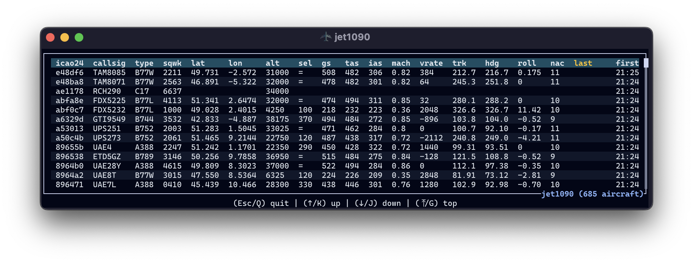

# Quickstart Guide for tangram

<p class="subtitle">How to quickly set up and run tangram with basic visualizations of aviation data</p>

!!! warning

    The framework has **only been tested on Linux and macOS**. It may not work on Windows without additional configuration.

    Contributions to improve Windows compatibility are welcome!

## Prerequisites

Before you begin, ensure you have the following tools installed:

1. [just](https://github.com/casey/just) is a **command runner**, similar to `make`, that simplifies running commands in your project.

2. [podman](https://podman.io/) is a **container engine** for developing, managing, and running containers, similar to Docker.

!!! tip

    You can have a running tangram instance in less than 5 minutes with these tools.

    It will also be possible to run some of the components outside of containers, but for the quickstart, we use containers to simplify the setup.

## 1. Environment Configuration

Create an environment file from the template:

```shell
cp .env.example .env
```

The file contains default configurations for a basic demo setup. You can modify it later to suit your needs.

## 2. Build Containers

Build the `tangram` and `jet1090` containers:

```shell
just build-tangram
just build-jet1090
```

!!! note

    The `jet1090` executable can also be easily installed directly on your system if you prefer not to use a container. Check the [jet1090 documentation](https://mode-s.org/jet1090/) for installation instructions. However, the default configuration works with a containerized version for simplicity.

## 3. Launch Redis

Start a Redis container for message passing and caching between different services:

```shell
just redis
```

This command will pull the Redis image if not already available and start the container.

!!! note

    The redis container will keep running in the background, allowing other services to connect to it.

    You can check if Redis is running with:

    ```shell
    podman container ls
    ```

    You can stop the container with:

    ```shell
    podman container stop redis
    ```

## 4. Run the data receiver

Set up the data source parameters and run the `jet1090` container:

```shell
just jet1090
```

You should now see the `jet1090` console displaying data received from the source:



## 5. Launch tangram

In a new terminal, run the tangram container:

```shell
just tangram
```

The container is orchestrated using [`process_compose`](https://github.com/F1bonacc1/process-compose), which manages the various background processes required for tangram to function.


You may click on each process to see its logs in real-time. The `web` process is the web server that serves the tangram interface.

## 6. Access the web interface

Open your browser and navigate to <http://localhost:2345> to access the tangram web interface.


## Troubleshooting

| Issue                                 | Command                                          |
| ------------------------------------- | ------------------------------------------------ |
| Check the logs for errors             | `just tangram-log`                               |
| Open a shell in the tangram container | `just tangram-shell`                             |
| Ensure all containers are running     | `podman container ls`                            |
| Verify Redis connection               | `podman container exec -it redis redis-cli ping` |
