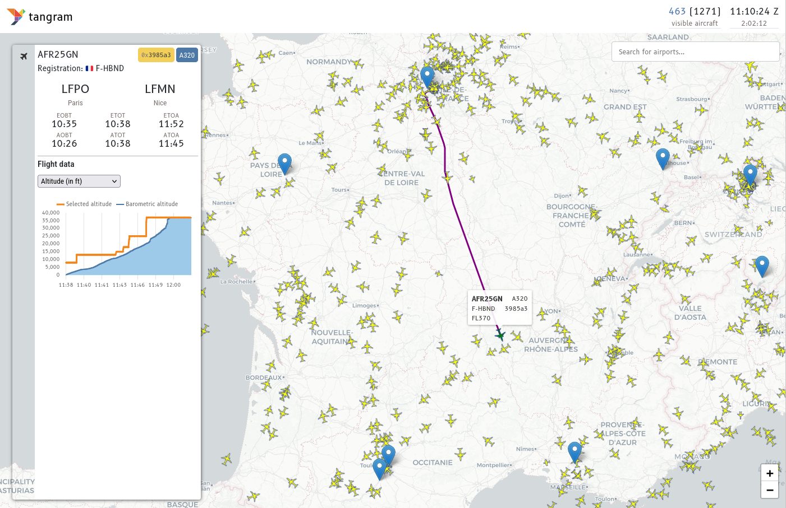

# tangram

tangram is an open framework that aggregates and processes ADS-B and Mode S surveillance data for real-time analysis. It provides a flexible plugin architecture where users can easily implement custom analyzers for their specific needs.

The system consists of a JavaScript frontend and a Python backend built with FastAPI. The backend efficiently aggregates data from multiple receiver streams and exposes a WebSocket interface, enabling real-time data visualization and analysis in the browser-based frontend.

## Documentation

Documentation is available at <https://mode-s.org/tangram/>

## Tests

Unit tests are limited to what invidual components can provide, including [jet1090](https://github.com/xoolive/rs1090/actions).\
The system is designed to be modular, so each component can be tested independently.

Integration tests is currently limited to the construction of the container image, with the `just create-tangram` command.

## Funding

This project is currently funded by the Dutch Research Council (NWO)'s Open Science Fund, **OSF23.1.051**: https://www.nwo.nl/en/projects/osf231051.

## History

In 2020, @junzis and @xoolive published a paper [Detecting and Measuring Turbulence from Mode S Surveillance Downlink Data](https://research.tudelft.nl/en/publications/detecting-and-measuring-turbulence-from-mode-s-surveillance-downl-2) on how real-time Mode S data can be used to detect turbulence.

Based on this method, @MichelKhalaf started developing this tool as part of his training with @xoolive in 2021, which was completed in Summer 2022. After that, the project was then lightly maintained by @xoolive and @junzis, while we have been applying for funding to continue this tool.

And in 2023, we received funding from NWO to continue the development of this tool. With this funding, @emctoo from [Shinetech](https://www.shinetechsoftware.com) was hired to work alongside us on this open-source project.
