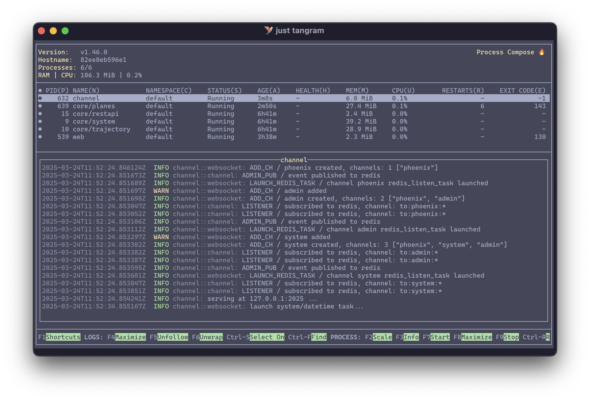

# Tangram

Tangram is an open framework that aggregates and processes ADS-B and Mode S surveillance data for real-time analysis. It provides a flexible plugin architecture where users can easily implement custom analyzers for their specific needs.

The system consists of a JavaScript frontend and a Python backend built with FastAPI. The backend efficiently aggregates data from multiple receiver streams and exposes a WebSocket interface, enabling real-time data visualization and analysis in the browser-based frontend.

## Quick start

1. Install [just](https://github.com/casey/just), a command project-specific runner
2. Install [podman](https://podman.io/docs/installation), a container runtime

   On macOS, Podman requires a virtual machine to run containers. You need to initialize and start this machine:
   Code

   ```shell
   podman machine init
   podman machine start
   ```


3. Create a `.env` file from the template (edit if necessary):

   ```shell
   cp .env.example .env
   ```


4. Pull and run a `Redis` container\
   This container is used for message caching between different services:

   ```shell
   just redis  # runs in daemon mode
   ```

5. Pull and run `jet1090` for decoding Mode S messages

   ```shell
   just jet1090
   ```

   The sources are defined in `config_jet1090.toml`; the path to this file is defined in the `.env` file. You should be able to see the `jet1090` console, which contains the data that is being received from the source, for example:

   

6. Build and run the tangram container (in another terminal):

   ```shell
   just create-tangram  # only once
   just tangram
   ```

   You should be able to see the [process compose](https://f1bonacc1.github.io/process-compose/) console, which contains all the processes that are running in the background, for example:

   

7. Visualize the live data from <http://localhost:2024> in your browser.

   Here is an example screenshot of the tool running in real-time:

   

## Funding

This project is currently funded by the Dutch Research Council (NWO)'s Open Science Fund, **OSF23.1.051**: https://www.nwo.nl/en/projects/osf231051.

## History

In 2020, @junzis and @xoolive published a paper [Detecting and Measuring Turbulence from Mode S Surveillance Downlink Data](https://research.tudelft.nl/en/publications/detecting-and-measuring-turbulence-from-mode-s-surveillance-downl-2) on how real-time Mode S data can be used to detect turbulence.

Based on this method, @MichelKhalaf started developing this tool as part of his training with @xoolive in 2021, which was completed in Summer 2022. After that, the project was then lightly maintained by @xoolive and @junzis, while we have been applying for funding to continue this tool.

And in 2023, we received funding from NWO to continue the development of this tool. With this funding, @emctoo from [Shinetech](https://www.shinetechsoftware.com) was hired to work alongside us on this open-source project.
